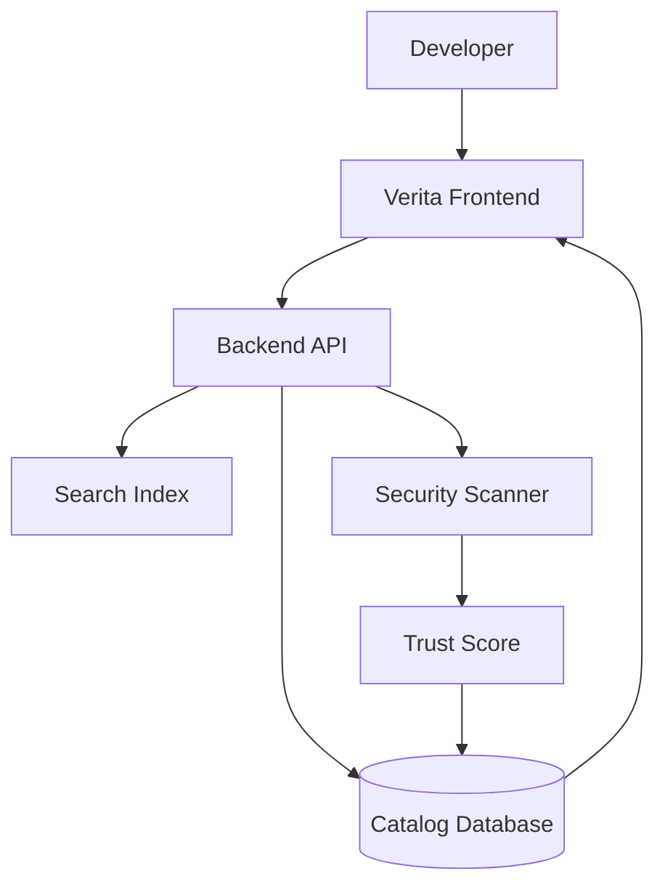
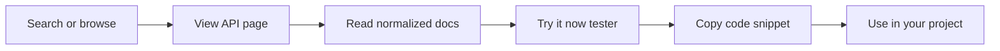
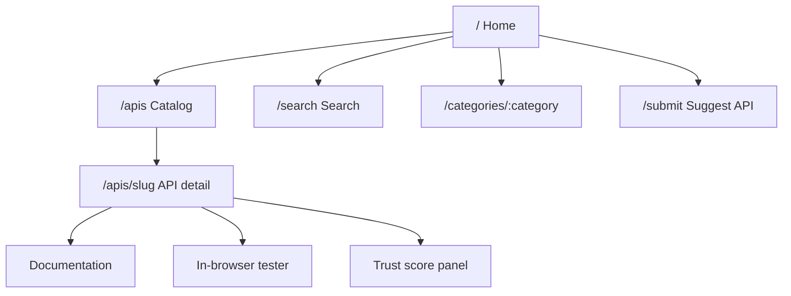
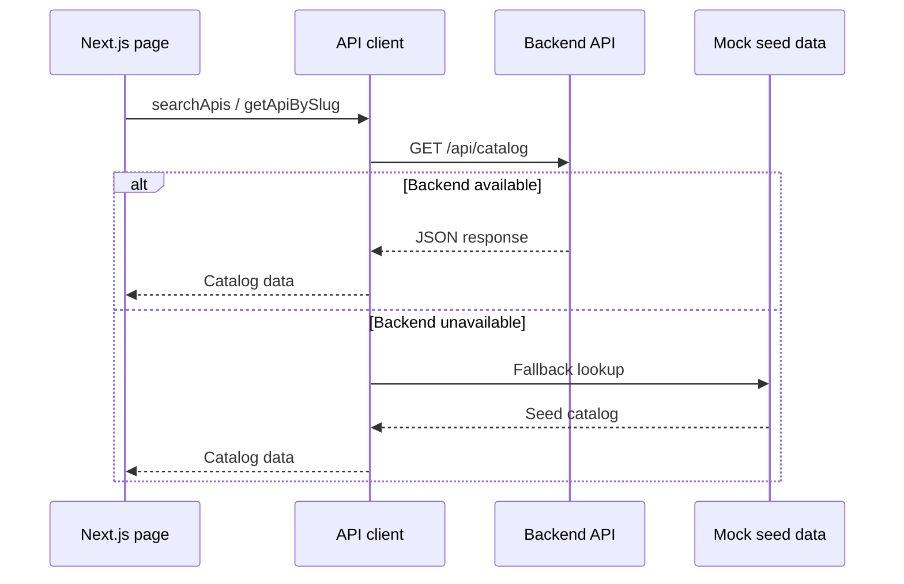
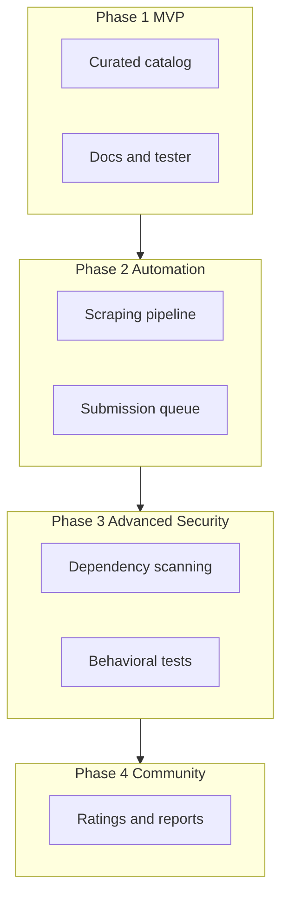

# Verita — Frontend

Web frontend for **Verita**, a platform that discovers, catalogs, documents, and helps developers safely evaluate free and open-source APIs.

Verita combines search, normalized documentation, in-browser testing, and trust scoring so developers can go from discovery to a working integration with confidence.

## Tech stack

| Layer | Tools |
| --- | --- |
| Framework | Next.js 16 (App Router) |
| UI | React 19, Tailwind CSS 4 |
| Language | TypeScript |
| Data | REST client with mock fallback for local development |

## System overview

How Verita fits into the wider platform:



## User journey

Typical flow through the product:



## Frontend routes

App Router pages and how they connect:



## Data flow

How the frontend loads catalog data during development and in production:



## Project structure

```text
src/
├── app/                         # App Router pages
│   ├── page.tsx                 # Home (search + featured APIs)
│   ├── apis/
│   │   ├── page.tsx             # Catalog listing
│   │   └── [slug]/page.tsx      # API docs, tester, trust score
│   ├── categories/[category]/   # Category-filtered catalog
│   ├── search/                  # Search results
│   ├── submit/                  # Suggest API (Phase 2 placeholder)
│   └── admin/                   # Admin dashboard shell
├── components/
│   ├── layout/                  # Header, footer, shell
│   ├── catalog/                 # Search, filters, API cards
│   ├── api-detail/              # Docs, endpoints, security badges
│   ├── tester/                  # In-browser API tester
│   └── ui/                      # Shared UI primitives
├── data/mock-apis.ts            # Phase 1 seed catalog
├── hooks/                       # Client-side search and tester hooks
├── lib/
│   ├── api/                     # Backend client and endpoint map
│   ├── constants/               # App config and categories
│   └── utils/                   # Formatting helpers
└── types/                       # Shared TypeScript types
```

## Getting started

### Prerequisites

- Node.js 20+
- npm 10+

### Setup

```bash
cp .env.example .env.local
npm install
npm run dev
```

Open [http://localhost:3000](http://localhost:3000).

### Environment variables

| Variable | Description | Default |
| --- | --- | --- |
| `NEXT_PUBLIC_API_URL` | Backend base URL | `http://localhost:8000` |

When the backend is not running, the UI automatically falls back to seed data in `src/data/mock-apis.ts`.

## Scripts

| Command | Description |
| --- | --- |
| `npm run dev` | Start the development server |
| `npm run build` | Create a production build |
| `npm run start` | Run the production server |
| `npm run lint` | Run ESLint |

## MVP scope (Phase 1)

- Curated catalog pages with trust badges
- Normalized documentation layout per API
- Simple GET-only in-browser tester
- Code snippet export (cURL, JavaScript, Python)
- Admin dashboard shell for future moderation tools

## Roadmap alignment



## Related docs

- Product specification: [`Project_Documentation_Free_API_Hub.md`](./Project_Documentation_Free_API_Hub.md)

## Notes on Mermaid in this README

Diagrams use GitHub-compatible Mermaid syntax:

- Standard `flowchart` and `sequenceDiagram` blocks
- Quoted labels for nodes that contain slashes or special characters
- No custom themes or HTML styling that GitHub may not render

If a diagram does not appear immediately on GitHub, refresh the page or view the file on github.com rather than in a plain-text preview.
